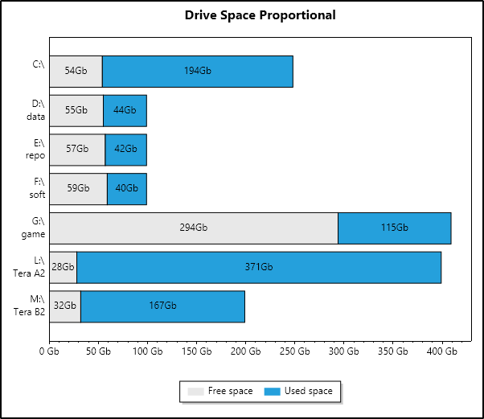

# Proportional Drive Space
Are you looking for the free space on one of your drives and want to see it immediately?
Most software displays all drives with the same visual size, making a 1 TB drive appear the same size as a 50 GB drive. This makes it difficult to get a clear sense of the actual available space on each drive.

**Proportional Drive Space** is a simple software that visualizes disk space in a proportional way. Its main use is to help users quickly identify drives with large amounts of free space, making it easier to store large files, copy datasets, install new video games, among other things.

## Download and installation

* Download the [latest release](https://github.com/marckruzik/Proportional_Drive_Space/releases)
* Unzip the exe somewhere
* Run the exe

Note: if Windows tells you it's unsafe to run the exe, click on "More info" then the "Run Anyway" button.

* The app displays the plot automatically.
* Click the Refresh button (top left) to refresh the plot.

## Tech stack

(for developers)

### Prototype: Polyglot Notebook
If you want to run the prototype C# Polyglot Notebook [main.dib](./main.dib), you can install **VS Code** with the Polyglot Notebook extension:

https://code.visualstudio.com/docs/languages/polyglot

### Executable: Avalonia UI

https://avaloniaui.net

### Nuget: ScottPlot
Used in the notebook and the exe, ScottPlot displays the chart.

https://scottplot.net

https://www.nuget.org/packages/ScottPlot

The foolowing features are used:

* Stacked bars: with specified left and right positions.
* Vertical display.
* Explicit positioning for bars and ticks: ensuring data is displayed in the order provided by the code, as ScottPlot is designed to place the first element at the bottom of the chart.
* Textual ticks: on the left axis, displaying the drive names.
* Custom ticks: on the bottom axis, showing the total size in GB.
* Custom legend: for creating and displaying a legend independently from the bar code.

### Custom calculations
The total height of the graph is automatically adjusted based on the number of drives.

## Shortcomings
* Small values are displayed in a space that is too small (see [complex example](image/complex.png)).
* Each group of bars is created separately (one drive = one group of bars), which limits the ability to apply shared data, such as the legend, to all bars of the same color.
* The exe is made using Avalonia, as it is the only way to get an exe file with UI below 20 Mb. Other solutions (WPF, WinUI 3, Blazor Hybrid) cannot be trimmed or are too big (around 70-120 Mb).
  * AOT with Direct2D could be used to make a small file (below 5 Mb ?), but it would be impossible to use UI controls such as buttons.
  * Avalonia does not have a toolbox with controls, it's all xaml-like writing. Fine for a one screen app.
* The plot is not interactive.
  * There is a nuget [ScottPlot.Avalonia](https://www.nuget.org/packages/ScottPlot.Avalonia), to make interactive plots. Maybe the plot could be made interactive, depending on the possibilities of this nuget.
* The code uses `DriveInfo.GetDrives()`, which does not appear to detect ext4 partitions (Linux partitions).
  * Windows does not natively support ext4 partitions, so `DriveInfo.GetDrives()` likely cannot detect them.
* The software does not display its version number. The only way to find the version number is to look at the name of the ZIP file or the name of the uncompressed folder (if preserved).
  * Displaying the version number in the title would make it easy to see the version number, and ensure that users are running the latest version when reporting problems.
